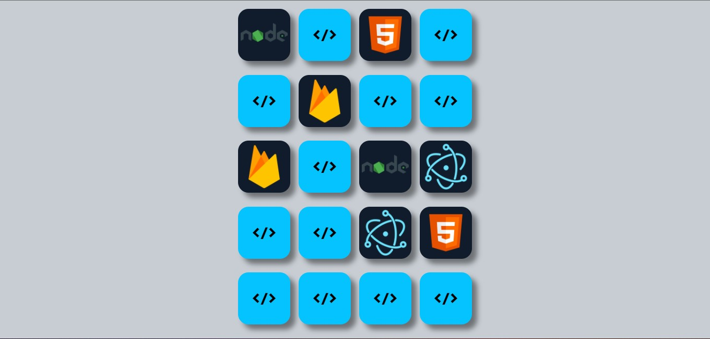

# Technologies Memory Game

A simple Memory game to practice javascript and frontend skills.

## Screenshot

<h3 align="center">
  
</h3>

## About the project

This project is one of the PROGRAMADOR Br course module, to help and practice javascript and frontend skills.
  
Using MVC architecture where the view doesn't know the business rule layer of the game,
the shuffling and random generation of cards is also implemented, so that each game is different.

## 👾 Technologies

- Semantic HTML
- CSS (SCSS)
- Javascript

## License

[MIT](https://choosealicense.com/licenses/mit/)
